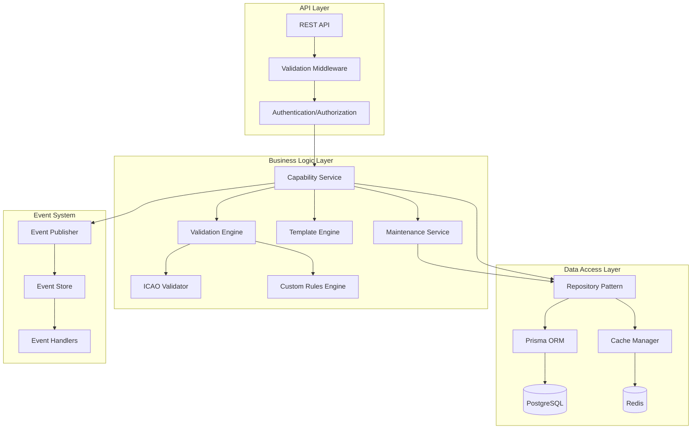
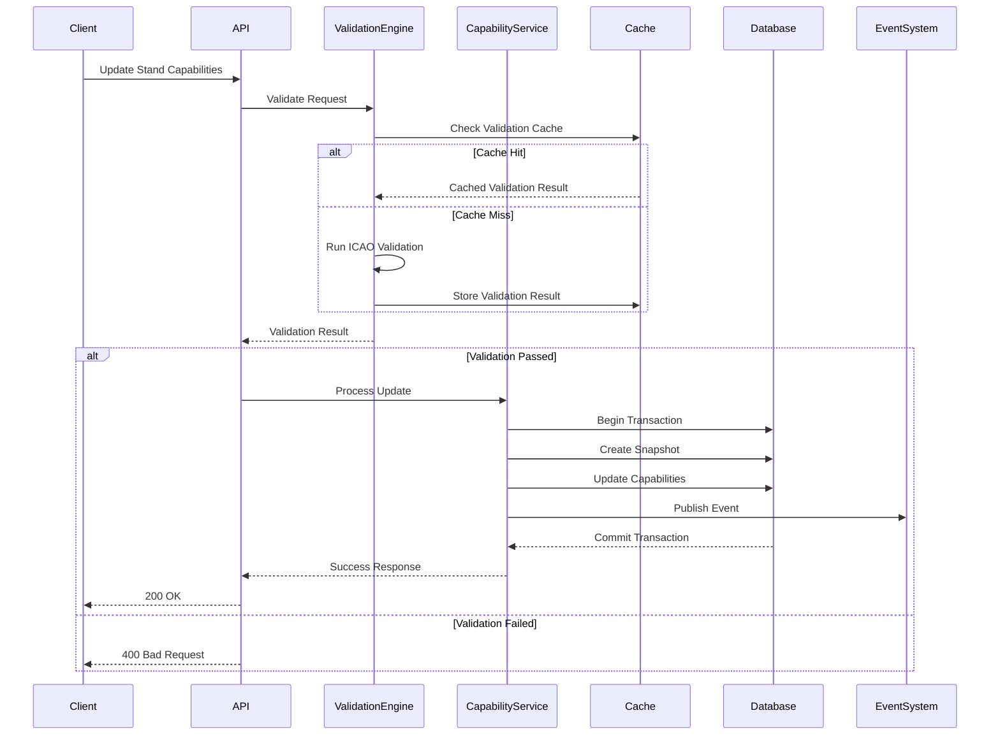

# TDD: Stand Capabilities and Metadata Enhancement

**Feature**: Comprehensive Stand Capabilities and Metadata Schema  
**Version**: 1.1.1.1  
**Date**: January 2025  
**Owner**: Engineering Team  
**Status**: Ready for Implementation  
**PRD Reference**: 1.1.1.1-Capability-of-Stands-Table-PRD.MD

## Table of Contents

1. [Technical Overview](#technical-overview)
2. [Architecture Design](#architecture-design)
3. [Database Design](#database-design)
4. [API Design](#api-design)
5. [Data Validation Framework](#data-validation-framework)
6. [Performance Optimization](#performance-optimization)
7. [Security Implementation](#security-implementation)
8. [Testing Strategy](#testing-strategy)
9. [Migration Plan](#migration-plan)
10. [Monitoring & Observability](#monitoring--observability)
11. [Deployment Strategy](#deployment-strategy)

## Technical Overview

### System Context

The Stand Capabilities enhancement will be implemented as an extension to the existing Assets Module, providing a robust data foundation for future capacity planning and operational modules. The implementation focuses on data storage, validation, and metadata management without including capacity calculations or analysis algorithms.

### Key Technical Decisions

1. **JSON Storage Strategy**: Use PostgreSQL JSONB columns with GIN indexes for complex capability data
2. **Validation Architecture**: Implement a multi-stage validation pipeline with caching
3. **Event-Driven Updates**: Use domain events for capability changes with eventual consistency
4. **Template Engine**: Build a flexible template system with inheritance support
5. **Performance First**: Design for sub-200ms response times with intelligent caching

### Technology Stack

- **Database**: PostgreSQL 14+ with JSONB support
- **ORM**: Prisma 5.x with custom extensions
- **API**: REST with OpenAPI 3.0 specification
- **Validation**: Zod schemas with custom validators
- **Caching**: Redis for validation results and templates
- **Events**: PostgreSQL LISTEN/NOTIFY with fallback to polling
- **Monitoring**: OpenTelemetry with Prometheus metrics

## Architecture Design

### Component Architecture



### Data Flow Architecture



## Database Design

### Optimized Schema Design

```sql
-- Create assets schema if not exists
CREATE SCHEMA IF NOT EXISTS assets;

-- Enable required extensions
CREATE EXTENSION IF NOT EXISTS "uuid-ossp";
CREATE EXTENSION IF NOT EXISTS "btree_gin";

-- Optimized stands table with indexed JSONB columns
CREATE TABLE assets.stands (
    id UUID DEFAULT uuid_generate_v4() PRIMARY KEY,
    organization_id UUID NOT NULL,
    code VARCHAR(20) NOT NULL,
    name VARCHAR(100) NOT NULL,
    terminal VARCHAR(50),
    status VARCHAR(20) DEFAULT 'operational' CHECK (status IN ('operational', 'maintenance', 'closed')),
    
    -- JSONB columns with GIN indexes
    dimensions JSONB DEFAULT '{}' NOT NULL,
    aircraft_compatibility JSONB DEFAULT '{}' NOT NULL,
    ground_support JSONB DEFAULT '{}' NOT NULL,
    operational_constraints JSONB DEFAULT '{}' NOT NULL,
    environmental_features JSONB DEFAULT '{}' NOT NULL,
    infrastructure JSONB DEFAULT '{}' NOT NULL,
    
    -- Geometry for spatial queries
    geometry JSONB,
    latitude DECIMAL(10, 8),
    longitude DECIMAL(11, 8),
    elevation DECIMAL(8, 2),
    
    -- Legacy support
    capabilities JSONB DEFAULT '{}',
    metadata JSONB DEFAULT '{}',
    
    -- Audit fields
    created_at TIMESTAMPTZ DEFAULT NOW(),
    updated_at TIMESTAMPTZ DEFAULT NOW(),
    created_by UUID,
    updated_by UUID,
    
    CONSTRAINT uk_stands_org_code UNIQUE (organization_id, code)
);

-- Create indexes for JSONB queries
CREATE INDEX idx_stands_dimensions ON assets.stands USING GIN (dimensions);
CREATE INDEX idx_stands_aircraft_compatibility ON assets.stands USING GIN (aircraft_compatibility);
CREATE INDEX idx_stands_ground_support ON assets.stands USING GIN (ground_support);
CREATE INDEX idx_stands_operational_constraints ON assets.stands USING GIN (operational_constraints);
CREATE INDEX idx_stands_status ON assets.stands (status) WHERE status != 'operational';
CREATE INDEX idx_stands_org_id ON assets.stands (organization_id);

-- Capability snapshots for rollback support
CREATE TABLE assets.stand_capability_snapshots (
    id UUID DEFAULT uuid_generate_v4() PRIMARY KEY,
    stand_id UUID NOT NULL REFERENCES assets.stands(id) ON DELETE CASCADE,
    snapshot_reason VARCHAR(50) NOT NULL,
    capabilities JSONB NOT NULL,
    created_at TIMESTAMPTZ DEFAULT NOW(),
    created_by UUID,
    
    INDEX idx_snapshots_stand_id (stand_id),
    INDEX idx_snapshots_created_at (created_at)
);

-- Maintenance records with improved performance
CREATE TABLE assets.stand_maintenance_records (
    id UUID DEFAULT uuid_generate_v4() PRIMARY KEY,
    stand_id UUID NOT NULL REFERENCES assets.stands(id),
    organization_id UUID NOT NULL,
    
    maintenance_type VARCHAR(20) NOT NULL CHECK (maintenance_type IN ('routine', 'emergency', 'upgrade', 'inspection')),
    category VARCHAR(30) NOT NULL,
    description TEXT NOT NULL,
    work_order_ref VARCHAR(100),
    
    scheduled_start TIMESTAMPTZ NOT NULL,
    scheduled_end TIMESTAMPTZ NOT NULL,
    actual_start TIMESTAMPTZ,
    actual_end TIMESTAMPTZ,
    
    status VARCHAR(20) DEFAULT 'scheduled' CHECK (status IN ('scheduled', 'in_progress', 'completed', 'cancelled', 'deferred')),
    priority VARCHAR(20) DEFAULT 'normal' CHECK (priority IN ('low', 'normal', 'high', 'urgent', 'critical')),
    
    adjacent_stands_affected JSONB DEFAULT '[]',
    operational_impact JSONB DEFAULT '{}',
    capabilities_affected JSONB DEFAULT '[]',
    capability_restrictions JSONB DEFAULT '{}',
    
    contractor VARCHAR(100),
    maintenance_team VARCHAR(100),
    cost DECIMAL(12, 2),
    actual_cost DECIMAL(12, 2),
    
    notes TEXT,
    completion_notes TEXT,
    attachments JSONB DEFAULT '[]',
    compliance_checks JSONB DEFAULT '{}',
    
    created_at TIMESTAMPTZ DEFAULT NOW(),
    updated_at TIMESTAMPTZ DEFAULT NOW(),
    created_by UUID,
    updated_by UUID,
    completed_by UUID,
    approved_by UUID
);

-- Indexes for maintenance queries
CREATE INDEX idx_maintenance_stand_id ON assets.stand_maintenance_records (stand_id);
CREATE INDEX idx_maintenance_org_id ON assets.stand_maintenance_records (organization_id);
CREATE INDEX idx_maintenance_status ON assets.stand_maintenance_records (status) WHERE status IN ('scheduled', 'in_progress');
CREATE INDEX idx_maintenance_scheduled ON assets.stand_maintenance_records (scheduled_start, scheduled_end);
CREATE INDEX idx_maintenance_adjacent ON assets.stand_maintenance_records USING GIN (adjacent_stands_affected);

-- Stand adjacencies with bidirectional support
CREATE TABLE assets.stand_adjacencies (
    id UUID DEFAULT uuid_generate_v4() PRIMARY KEY,
    organization_id UUID NOT NULL,
    stand_id UUID NOT NULL REFERENCES assets.stands(id),
    adjacent_stand_id UUID NOT NULL REFERENCES assets.stands(id),
    
    adjacency_type VARCHAR(20) NOT NULL CHECK (adjacency_type IN ('physical', 'operational', 'safety_zone')),
    distance DECIMAL(6, 2),
    direction VARCHAR(20),
    
    impact_level VARCHAR(20) DEFAULT 'medium' CHECK (impact_level IN ('low', 'medium', 'high', 'critical')),
    impact_reasons JSONB DEFAULT '[]',
    
    simultaneous_operations BOOLEAN DEFAULT true,
    maintenance_impact JSONB DEFAULT '{}',
    
    is_active BOOLEAN DEFAULT true,
    created_at TIMESTAMPTZ DEFAULT NOW(),
    updated_at TIMESTAMPTZ DEFAULT NOW(),
    
    CONSTRAINT uk_adjacency UNIQUE (stand_id, adjacent_stand_id),
    CHECK (stand_id != adjacent_stand_id)
);

-- Create bidirectional index
CREATE INDEX idx_adjacency_bidirectional ON assets.stand_adjacencies (stand_id, adjacent_stand_id);
CREATE INDEX idx_adjacency_reverse ON assets.stand_adjacencies (adjacent_stand_id, stand_id);

-- Capability templates
CREATE TABLE assets.stand_capability_templates (
    id UUID DEFAULT uuid_generate_v4() PRIMARY KEY,
    organization_id UUID NOT NULL,
    name VARCHAR(100) NOT NULL,
    aircraft_category CHAR(1) NOT NULL CHECK (aircraft_category IN ('A', 'B', 'C', 'D', 'E', 'F')),
    description TEXT,
    
    dimension_template JSONB DEFAULT '{}' NOT NULL,
    compatibility_template JSONB DEFAULT '{}' NOT NULL,
    ground_support_template JSONB DEFAULT '{}' NOT NULL,
    operational_template JSONB DEFAULT '{}' NOT NULL,
    
    is_active BOOLEAN DEFAULT true,
    created_at TIMESTAMPTZ DEFAULT NOW(),
    updated_at TIMESTAMPTZ DEFAULT NOW(),
    created_by UUID,
    updated_by UUID,
    
    CONSTRAINT uk_template_name UNIQUE (organization_id, name)
);

-- Utilization patterns
CREATE TABLE assets.stand_utilization_patterns (
    id UUID DEFAULT uuid_generate_v4() PRIMARY KEY,
    stand_id UUID NOT NULL REFERENCES assets.stands(id),
    organization_id UUID NOT NULL,
    
    hourly_pattern JSONB DEFAULT '{}' NOT NULL,
    daily_pattern JSONB DEFAULT '{}' NOT NULL,
    seasonal_pattern JSONB DEFAULT '{}' NOT NULL,
    
    average_occupancy DECIMAL(3, 2) DEFAULT 0 CHECK (average_occupancy >= 0 AND average_occupancy <= 1),
    peak_occupancy DECIMAL(3, 2) DEFAULT 0 CHECK (peak_occupancy >= 0 AND peak_occupancy <= 1),
    turnover_rate DECIMAL(5, 2) DEFAULT 0 CHECK (turnover_rate >= 0),
    
    data_source VARCHAR(20) NOT NULL CHECK (data_source IN ('historical', 'predicted', 'manual')),
    valid_from TIMESTAMPTZ NOT NULL,
    valid_to TIMESTAMPTZ,
    
    created_at TIMESTAMPTZ DEFAULT NOW(),
    updated_at TIMESTAMPTZ DEFAULT NOW(),
    
    CONSTRAINT check_occupancy CHECK (peak_occupancy >= average_occupancy)
);

-- Create update trigger for updated_at
CREATE OR REPLACE FUNCTION assets.update_updated_at_column()
RETURNS TRIGGER AS $$
BEGIN
    NEW.updated_at = NOW();
    RETURN NEW;
END;
$$ language 'plpgsql';

CREATE TRIGGER update_stands_updated_at BEFORE UPDATE ON assets.stands
    FOR EACH ROW EXECUTE FUNCTION assets.update_updated_at_column();

CREATE TRIGGER update_maintenance_updated_at BEFORE UPDATE ON assets.stand_maintenance_records
    FOR EACH ROW EXECUTE FUNCTION assets.update_updated_at_column();

CREATE TRIGGER update_templates_updated_at BEFORE UPDATE ON assets.stand_capability_templates
    FOR EACH ROW EXECUTE FUNCTION assets.update_updated_at_column();
```

### Performance Optimization Views

```sql
-- Materialized view for stand capability summary
CREATE MATERIALIZED VIEW assets.stand_capability_summary AS
SELECT 
    s.id,
    s.organization_id,
    s.code,
    s.name,
    s.status,
    s.terminal,
    -- Extract key capability indicators
    (s.dimensions->>'length')::numeric as length_m,
    (s.dimensions->>'width')::numeric as width_m,
    s.aircraft_compatibility->'supportedCategories' as supported_categories,
    (s.aircraft_compatibility->>'maxTakeoffWeight')::numeric as max_takeoff_weight,
    s.ground_support->'powerSupply'->>'available' as has_power,
    s.ground_support->'fuelHydrant'->>'available' as has_fuel_hydrant,
    -- Maintenance status
    CASE 
        WHEN EXISTS (
            SELECT 1 FROM assets.stand_maintenance_records m 
            WHERE m.stand_id = s.id 
            AND m.status IN ('scheduled', 'in_progress')
            AND m.scheduled_start <= NOW() 
            AND m.scheduled_end >= NOW()
        ) THEN true 
        ELSE false 
    END as under_maintenance,
    s.updated_at
FROM assets.stands s;

-- Create indexes on materialized view
CREATE INDEX idx_capability_summary_org ON assets.stand_capability_summary (organization_id);
CREATE INDEX idx_capability_summary_categories ON assets.stand_capability_summary USING GIN (supported_categories);

-- Refresh strategy
CREATE OR REPLACE FUNCTION assets.refresh_capability_summary()
RETURNS void AS $$
BEGIN
    REFRESH MATERIALIZED VIEW CONCURRENTLY assets.stand_capability_summary;
END;
$$ LANGUAGE plpgsql;
```

## API Design

### RESTful API Implementation

```typescript
// API Route Structure
const routes = {
  // Stand Capabilities
  'GET /api/assets/stands/:standId/capabilities': 'getStandCapabilities',
  'PUT /api/assets/stands/:standId/capabilities': 'updateStandCapabilities',
  'PATCH /api/assets/stands/:standId/capabilities/:capabilityType': 'updateSpecificCapability',
  
  // Bulk Operations
  'POST /api/assets/stands/capabilities/bulk-update': 'bulkUpdateCapabilities',
  'POST /api/assets/stands/capabilities/validate': 'validateCapabilities',
  
  // Templates
  'GET /api/assets/stands/capability-templates': 'listCapabilityTemplates',
  'POST /api/assets/stands/capability-templates': 'createCapabilityTemplate',
  'POST /api/assets/stands/:standId/capabilities/apply-template': 'applyTemplate',
  
  // Maintenance
  'GET /api/assets/stands/:standId/maintenance': 'getMaintenanceRecords',
  'POST /api/assets/stands/:standId/maintenance': 'createMaintenanceRecord',
  'PUT /api/assets/stands/:standId/maintenance/:recordId': 'updateMaintenanceRecord',
  'GET /api/assets/stands/maintenance/history': 'getMaintenanceHistory',
  
  // Adjacencies
  'GET /api/assets/stands/:standId/adjacencies': 'getStandAdjacencies',
  'POST /api/assets/stands/:standId/adjacencies': 'createAdjacency',
  'GET /api/assets/stands/adjacencies/impact-analysis': 'getAdjacencyImpactAnalysis',
  
  // Analytics
  'GET /api/assets/stands/:standId/utilization': 'getUtilizationPatterns',
  'GET /api/assets/stands/analytics/capacity-overview': 'getCapacityOverview',
};
```

### Request/Response Examples

```typescript
// Update Stand Capabilities Request
interface UpdateCapabilitiesRequest {
  dimensions?: Partial<StandDimensions>;
  aircraftCompatibility?: Partial<AircraftCompatibility>;
  groundSupport?: Partial<GroundSupportCapabilities>;
  operationalConstraints?: Partial<OperationalConstraints>;
  environmentalFeatures?: Partial<EnvironmentalFeatures>;
  infrastructure?: Partial<InfrastructureCapabilities>;
  reason: string; // Required for audit
}

// Response with validation
interface UpdateCapabilitiesResponse {
  success: boolean;
  data?: {
    standId: string;
    capabilities: StandCapabilities;
    validationResult: ValidationResult;
    snapshotId: string; // For rollback support
  };
  error?: {
    code: string;
    message: string;
    validationErrors?: ValidationError[];
  };
}

// Bulk Update Request
interface BulkUpdateCapabilitiesRequest {
  updates: Array<{
    standId: string;
    capabilities: Partial<StandCapabilities>;
  }>;
  validateOnly?: boolean;
  applyTemplateId?: string;
}

// Maintenance Impact Analysis Response
interface MaintenanceImpactResponse {
  primaryStand: {
    id: string;
    code: string;
    capacityReduction: number; // percentage
  };
  affectedStands: Array<{
    id: string;
    code: string;
    adjacencyType: string;
    impactLevel: string;
    restrictions: string[];
  }>;
  totalCapacityImpact: number; // percentage
  alternativeStands: string[];
  recommendations: string[];
}
```

### API Middleware Stack

```typescript
// Middleware implementation
export const capabilityMiddleware = {
  // Request validation middleware
  validateRequest: (schema: ZodSchema) => {
    return async (req: Request, res: Response, next: NextFunction) => {
      try {
        const validated = await schema.parseAsync(req.body);
        req.body = validated;
        next();
      } catch (error) {
        if (error instanceof ZodError) {
          return res.status(400).json({
            error: 'VALIDATION_ERROR',
            details: error.errors
          });
        }
        next(error);
      }
    };
  },

  // Performance tracking middleware
  trackPerformance: () => {
    return (req: Request, res: Response, next: NextFunction) => {
      const start = Date.now();
      
      res.on('finish', () => {
        const duration = Date.now() - start;
        metrics.apiRequestDuration.observe(
          { method: req.method, route: req.route.path, status: res.statusCode },
          duration / 1000
        );
      });
      
      next();
    };
  },

  // Cache middleware
  cacheResponse: (ttl: number = 300) => {
    return async (req: Request, res: Response, next: NextFunction) => {
      if (req.method !== 'GET') return next();
      
      const cacheKey = `api:${req.originalUrl}`;
      const cached = await cache.get(cacheKey);
      
      if (cached) {
        return res.json(JSON.parse(cached));
      }
      
      const originalJson = res.json;
      res.json = function(data) {
        cache.set(cacheKey, JSON.stringify(data), ttl);
        return originalJson.call(this, data);
      };
      
      next();
    };
  }
};
```

## Data Validation Framework

### Multi-Stage Validation Pipeline

```typescript
// Core validation engine
export class CapabilityValidationEngine {
  private validators: Map<string, IValidator> = new Map();
  private cache: IValidationCache;
  
  constructor(cache: IValidationCache) {
    this.cache = cache;
    this.registerValidators();
  }

  private registerValidators(): void {
    this.validators.set('dimensions', new DimensionsValidator());
    this.validators.set('aircraft', new AircraftCompatibilityValidator());
    this.validators.set('ground_support', new GroundSupportValidator());
    this.validators.set('operational', new OperationalConstraintsValidator());
    this.validators.set('environmental', new EnvironmentalValidator());
    this.validators.set('infrastructure', new InfrastructureValidator());
    this.validators.set('icao', new ICAOComplianceValidator());
  }

  async validate(
    capabilities: StandCapabilities,
    options: ValidationOptions = {}
  ): Promise<ValidationResult> {
    const startTime = Date.now();
    const cacheKey = this.generateCacheKey(capabilities, options);
    
    // Check cache
    if (!options.skipCache) {
      const cached = await this.cache.get(cacheKey);
      if (cached) {
        metrics.validationCacheHits.inc();
        return cached;
      }
    }
    
    // Initialize result
    const result: ValidationResult = {
      valid: true,
      errors: [],
      warnings: [],
      metadata: {
        duration: 0,
        validatorsRun: [],
        cacheKey
      }
    };
    
    // Run validators in parallel where possible
    const validationPromises: Promise<ValidationResult>[] = [];
    
    // Stage 1: Basic validators (can run in parallel)
    if (options.validateDimensions !== false) {
      validationPromises.push(
        this.runValidator('dimensions', capabilities.dimensions)
      );
    }
    
    if (options.validateGroundSupport !== false) {
      validationPromises.push(
        this.runValidator('ground_support', capabilities.groundSupport)
      );
    }
    
    // Wait for stage 1
    const stage1Results = await Promise.all(validationPromises);
    this.mergeResults(result, stage1Results);
    
    // Stage 2: Complex validators (depend on stage 1)
    if (result.valid && options.validateAircraft !== false) {
      const aircraftResult = await this.runValidator(
        'aircraft', 
        capabilities.aircraftCompatibility,
        { dimensions: capabilities.dimensions }
      );
      this.mergeResults(result, [aircraftResult]);
    }
    
    // Stage 3: Cross-validation (ICAO compliance)
    if (result.valid && options.validateICAO !== false) {
      const icaoResult = await this.runValidator('icao', capabilities);
      this.mergeResults(result, [icaoResult]);
    }
    
    // Finalize
    result.metadata.duration = Date.now() - startTime;
    
    // Cache result
    if (!options.skipCache && result.valid) {
      await this.cache.set(cacheKey, result, 300); // 5 minute TTL
    }
    
    // Update metrics
    metrics.validationDuration.observe(
      { type: 'full' },
      result.metadata.duration / 1000
    );
    
    return result;
  }

  private async runValidator(
    type: string,
    data: any,
    context?: any
  ): Promise<ValidationResult> {
    const validator = this.validators.get(type);
    if (!validator) {
      throw new Error(`Validator ${type} not found`);
    }
    
    try {
      const result = await validator.validate(data, context);
      result.metadata.validatorsRun.push(type);
      return result;
    } catch (error) {
      return {
        valid: false,
        errors: [{
          field: type,
          message: `Validator ${type} failed: ${error.message}`,
          severity: 'critical'
        }],
        warnings: [],
        metadata: { validatorsRun: [type] }
      };
    }
  }

  private mergeResults(target: ValidationResult, sources: ValidationResult[]): void {
    for (const source of sources) {
      target.valid = target.valid && source.valid;
      target.errors.push(...source.errors);
      target.warnings.push(...source.warnings);
      target.metadata.validatorsRun.push(...source.metadata.validatorsRun);
    }
  }

  private generateCacheKey(capabilities: StandCapabilities, options: ValidationOptions): string {
    const hash = crypto.createHash('sha256');
    hash.update(JSON.stringify(capabilities));
    hash.update(JSON.stringify(options));
    return `validation:${hash.digest('hex')}`;
  }
}

// ICAO Compliance Validator
export class ICAOComplianceValidator implements IValidator {
  private categorySpecs = {
    A: { maxWingspan: 15, maxGearSpan: 4.5, minClearance: 3 },
    B: { maxWingspan: 24, maxGearSpan: 6, minClearance: 3 },
    C: { maxWingspan: 36, maxGearSpan: 9, minClearance: 3 },
    D: { maxWingspan: 52, maxGearSpan: 14, minClearance: 4.5 },
    E: { maxWingspan: 65, maxGearSpan: 14, minClearance: 4.5 },
    F: { maxWingspan: 80, maxGearSpan: 16, minClearance: 4.5 }
  };

  async validate(capabilities: StandCapabilities): Promise<ValidationResult> {
    const result: ValidationResult = {
      valid: true,
      errors: [],
      warnings: [],
      metadata: { validatorsRun: ['icao'] }
    };

    // Validate dimensions against supported categories
    for (const category of capabilities.aircraftCompatibility.supportedCategories) {
      const spec = this.categorySpecs[category];
      
      // Check clearances
      if (capabilities.dimensions.wingTipClearance < spec.minClearance) {
        result.errors.push({
          field: 'dimensions.wingTipClearance',
          message: `Wing tip clearance ${capabilities.dimensions.wingTipClearance}m is below ICAO minimum ${spec.minClearance}m for category ${category}`,
          severity: 'error',
          code: 'ICAO_CLEARANCE_VIOLATION'
        });
        result.valid = false;
      }
      
      // Check dimensional compatibility
      if (capabilities.aircraftCompatibility.maxWingspan > spec.maxWingspan) {
        result.warnings.push({
          field: 'aircraftCompatibility.maxWingspan',
          message: `Max wingspan ${capabilities.aircraftCompatibility.maxWingspan}m exceeds ICAO category ${category} specification ${spec.maxWingspan}m`,
          severity: 'warning',
          code: 'ICAO_CATEGORY_MISMATCH'
        });
      }
    }
    
    // Validate pavement slopes
    if (Math.abs(capabilities.dimensions.longitudinalSlope) > 2) {
      result.errors.push({
        field: 'dimensions.longitudinalSlope',
        message: `Longitudinal slope ${capabilities.dimensions.longitudinalSlope}% exceeds ICAO maximum 2%`,
        severity: 'error',
        code: 'ICAO_SLOPE_VIOLATION'
      });
      result.valid = false;
    }
    
    if (Math.abs(capabilities.dimensions.transverseSlope) > 2) {
      result.errors.push({
        field: 'dimensions.transverseSlope',
        message: `Transverse slope ${capabilities.dimensions.transverseSlope}% exceeds ICAO maximum 2%`,
        severity: 'error',
        code: 'ICAO_SLOPE_VIOLATION'
      });
      result.valid = false;
    }

    return result;
  }
}
```

### Validation Cache Implementation

```typescript
export class ValidationCache implements IValidationCache {
  private redis: Redis;
  private localCache: Map<string, { result: ValidationResult; expires: number }>;
  
  constructor(redis: Redis) {
    this.redis = redis;
    this.localCache = new Map();
    this.startCleanupTimer();
  }

  async get(key: string): Promise<ValidationResult | null> {
    // Check local cache first
    const local = this.localCache.get(key);
    if (local && local.expires > Date.now()) {
      return local.result;
    }
    
    // Check Redis
    try {
      const cached = await this.redis.get(key);
      if (cached) {
        const result = JSON.parse(cached);
        // Update local cache
        this.localCache.set(key, {
          result,
          expires: Date.now() + 60000 // 1 minute local cache
        });
        return result;
      }
    } catch (error) {
      logger.warn('Redis cache error', { error, key });
    }
    
    return null;
  }

  async set(key: string, result: ValidationResult, ttl: number): Promise<void> {
    // Update local cache
    this.localCache.set(key, {
      result,
      expires: Date.now() + Math.min(ttl * 1000, 60000)
    });
    
    // Update Redis
    try {
      await this.redis.setex(key, ttl, JSON.stringify(result));
    } catch (error) {
      logger.warn('Redis cache set error', { error, key });
    }
  }

  private startCleanupTimer(): void {
    setInterval(() => {
      const now = Date.now();
      for (const [key, value] of this.localCache.entries()) {
        if (value.expires < now) {
          this.localCache.delete(key);
        }
      }
    }, 60000); // Cleanup every minute
  }
}
```

## Performance Optimization

### Query Optimization Strategies

```typescript
// Optimized repository implementation
export class StandCapabilityRepository {
  private db: PrismaClient;
  private queryCache: Map<string, { data: any; expires: number }>;

  constructor(db: PrismaClient) {
    this.db = db;
    this.queryCache = new Map();
  }

  async findByIdWithCapabilities(
    standId: string,
    options: { includeAdjacencies?: boolean; includeMaintenance?: boolean } = {}
  ): Promise<StandWithCapabilities | null> {
    const cacheKey = `stand:${standId}:${JSON.stringify(options)}`;
    const cached = this.getFromCache(cacheKey);
    if (cached) return cached;

    const query = this.db.stand.findUnique({
      where: { id: standId },
      select: {
        id: true,
        code: true,
        name: true,
        status: true,
        terminal: true,
        dimensions: true,
        aircraftCompatibility: true,
        groundSupport: true,
        operationalConstraints: true,
        environmentalFeatures: true,
        infrastructure: true,
        updatedAt: true,
        // Conditional includes
        ...(options.includeAdjacencies && {
          adjacencies: {
            select: {
              adjacentStandId: true,
              adjacencyType: true,
              impactLevel: true,
              simultaneousOperations: true
            }
          }
        }),
        ...(options.includeMaintenance && {
          _count: {
            select: {
              maintenanceRecords: {
                where: {
                  status: { in: ['scheduled', 'in_progress'] },
                  scheduledStart: { lte: new Date() },
                  scheduledEnd: { gte: new Date() }
                }
              }
            }
          }
        })
      }
    });

    const result = await query;
    if (result) {
      this.setCache(cacheKey, result, 300); // 5 minute cache
    }

    return result;
  }

  async updateCapabilities(
    standId: string,
    updates: Partial<StandCapabilities>,
    userId: string
  ): Promise<Stand> {
    return await this.db.$transaction(async (tx) => {
      // Get current state
      const current = await tx.stand.findUnique({
        where: { id: standId }
      });

      if (!current) {
        throw new Error('Stand not found');
      }

      // Create snapshot
      await tx.standCapabilitySnapshot.create({
        data: {
          standId,
          snapshotReason: 'pre_update',
          capabilities: {
            dimensions: current.dimensions,
            aircraftCompatibility: current.aircraftCompatibility,
            groundSupport: current.groundSupport,
            operationalConstraints: current.operationalConstraints,
            environmentalFeatures: current.environmentalFeatures,
            infrastructure: current.infrastructure
          },
          createdBy: userId
        }
      });

      // Merge updates
      const updated = await tx.stand.update({
        where: { id: standId },
        data: {
          ...(updates.dimensions && { dimensions: updates.dimensions }),
          ...(updates.aircraftCompatibility && { aircraftCompatibility: updates.aircraftCompatibility }),
          ...(updates.groundSupport && { groundSupport: updates.groundSupport }),
          ...(updates.operationalConstraints && { operationalConstraints: updates.operationalConstraints }),
          ...(updates.environmentalFeatures && { environmentalFeatures: updates.environmentalFeatures }),
          ...(updates.infrastructure && { infrastructure: updates.infrastructure }),
          updatedBy: userId
        }
      });

      // Invalidate caches
      this.invalidateCache(`stand:${standId}`);
      
      return updated;
    });
  }

  async bulkUpdateCapabilities(
    updates: Array<{ standId: string; capabilities: Partial<StandCapabilities> }>,
    userId: string
  ): Promise<void> {
    // Use PostgreSQL's JSONB update capabilities for efficiency
    const sql = `
      UPDATE assets.stands
      SET
        dimensions = COALESCE($2::jsonb, dimensions),
        aircraft_compatibility = COALESCE($3::jsonb, aircraft_compatibility),
        ground_support = COALESCE($4::jsonb, ground_support),
        operational_constraints = COALESCE($5::jsonb, operational_constraints),
        environmental_features = COALESCE($6::jsonb, environmental_features),
        infrastructure = COALESCE($7::jsonb, infrastructure),
        updated_by = $8,
        updated_at = NOW()
      WHERE id = $1
    `;

    const promises = updates.map(update => 
      this.db.$executeRawUnsafe(
        sql,
        update.standId,
        update.capabilities.dimensions ? JSON.stringify(update.capabilities.dimensions) : null,
        update.capabilities.aircraftCompatibility ? JSON.stringify(update.capabilities.aircraftCompatibility) : null,
        update.capabilities.groundSupport ? JSON.stringify(update.capabilities.groundSupport) : null,
        update.capabilities.operationalConstraints ? JSON.stringify(update.capabilities.operationalConstraints) : null,
        update.capabilities.environmentalFeatures ? JSON.stringify(update.capabilities.environmentalFeatures) : null,
        update.capabilities.infrastructure ? JSON.stringify(update.capabilities.infrastructure) : null,
        userId
      )
    );

    await Promise.all(promises);
    
    // Invalidate all affected caches
    updates.forEach(update => {
      this.invalidateCache(`stand:${update.standId}`);
    });
  }

  private getFromCache(key: string): any | null {
    const cached = this.queryCache.get(key);
    if (cached && cached.expires > Date.now()) {
      return cached.data;
    }
    return null;
  }

  private setCache(key: string, data: any, ttl: number): void {
    this.queryCache.set(key, {
      data,
      expires: Date.now() + (ttl * 1000)
    });
  }

  private invalidateCache(pattern: string): void {
    for (const key of this.queryCache.keys()) {
      if (key.startsWith(pattern)) {
        this.queryCache.delete(key);
      }
    }
  }
}
```

### Database Query Optimization

```sql
-- Function for efficient capability search
CREATE OR REPLACE FUNCTION assets.search_stands_by_capabilities(
    p_organization_id UUID,
    p_min_length NUMERIC DEFAULT NULL,
    p_min_width NUMERIC DEFAULT NULL,
    p_aircraft_categories TEXT[] DEFAULT NULL,
    p_required_ground_support TEXT[] DEFAULT NULL,
    p_exclude_maintenance BOOLEAN DEFAULT true
) RETURNS TABLE (
    stand_id UUID,
    stand_code VARCHAR,
    stand_name VARCHAR,
    match_score NUMERIC
) AS $$
BEGIN
    RETURN QUERY
    WITH capability_matches AS (
        SELECT 
            s.id,
            s.code,
            s.name,
            -- Calculate match score
            CASE 
                WHEN p_min_length IS NOT NULL AND (s.dimensions->>'length')::numeric >= p_min_length THEN 1
                ELSE 0
            END +
            CASE 
                WHEN p_min_width IS NOT NULL AND (s.dimensions->>'width')::numeric >= p_min_width THEN 1
                ELSE 0
            END +
            CASE 
                WHEN p_aircraft_categories IS NOT NULL AND 
                     s.aircraft_compatibility->'supportedCategories' ?| p_aircraft_categories THEN 2
                ELSE 0
            END +
            CASE 
                WHEN p_required_ground_support IS NOT NULL AND 
                     s.ground_support @> jsonb_build_object(
                         p_required_ground_support[1], jsonb_build_object('available', true)
                     ) THEN 1
                ELSE 0
            END AS score
        FROM assets.stands s
        WHERE s.organization_id = p_organization_id
          AND s.status = 'operational'
          AND (p_exclude_maintenance = false OR NOT EXISTS (
              SELECT 1 FROM assets.stand_maintenance_records m
              WHERE m.stand_id = s.id
                AND m.status IN ('scheduled', 'in_progress')
                AND m.scheduled_start <= NOW()
                AND m.scheduled_end >= NOW()
          ))
    )
    SELECT 
        id AS stand_id,
        code AS stand_code,
        name AS stand_name,
        score::numeric AS match_score
    FROM capability_matches
    WHERE score > 0
    ORDER BY score DESC, code;
END;
$$ LANGUAGE plpgsql;

-- Index for the search function
CREATE INDEX idx_stands_search_optimization ON assets.stands (
    organization_id,
    status,
    (dimensions->>'length'),
    (dimensions->>'width')
) WHERE status = 'operational';
```

## Security Implementation

### Enhanced Row Level Security

```sql
-- Enable RLS on all tables
ALTER TABLE assets.stands ENABLE ROW LEVEL SECURITY;
ALTER TABLE assets.stand_capability_templates ENABLE ROW LEVEL SECURITY;
ALTER TABLE assets.stand_maintenance_records ENABLE ROW LEVEL SECURITY;
ALTER TABLE assets.stand_adjacencies ENABLE ROW LEVEL SECURITY;
ALTER TABLE assets.stand_utilization_patterns ENABLE ROW LEVEL SECURITY;

-- Function to get user's organization
CREATE OR REPLACE FUNCTION assets.get_user_organization_id()
RETURNS UUID AS $$
BEGIN
    RETURN (
        SELECT organization_id 
        FROM public.users 
        WHERE id = auth.uid()
    );
END;
$$ LANGUAGE plpgsql SECURITY DEFINER;

-- Function to check user permissions
CREATE OR REPLACE FUNCTION assets.user_has_permission(required_permission TEXT)
RETURNS BOOLEAN AS $$
BEGIN
    RETURN EXISTS (
        SELECT 1 
        FROM public.user_permissions up
        JOIN public.permissions p ON up.permission_id = p.id
        WHERE up.user_id = auth.uid()
          AND p.name = required_permission
          AND up.is_active = true
    );
END;
$$ LANGUAGE plpgsql SECURITY DEFINER;

-- Stands table policies
CREATE POLICY stands_select_policy ON assets.stands
    FOR SELECT
    USING (organization_id = assets.get_user_organization_id());

CREATE POLICY stands_insert_policy ON assets.stands
    FOR INSERT
    WITH CHECK (
        organization_id = assets.get_user_organization_id()
        AND assets.user_has_permission('stands.create')
    );

CREATE POLICY stands_update_policy ON assets.stands
    FOR UPDATE
    USING (
        organization_id = assets.get_user_organization_id()
        AND assets.user_has_permission('stands.update')
    )
    WITH CHECK (organization_id = assets.get_user_organization_id());

CREATE POLICY stands_delete_policy ON assets.stands
    FOR DELETE
    USING (
        organization_id = assets.get_user_organization_id()
        AND assets.user_has_permission('stands.delete')
    );

-- Maintenance records policies with role-based access
CREATE POLICY maintenance_select_policy ON assets.stand_maintenance_records
    FOR SELECT
    USING (organization_id = assets.get_user_organization_id());

CREATE POLICY maintenance_insert_policy ON assets.stand_maintenance_records
    FOR INSERT
    WITH CHECK (
        organization_id = assets.get_user_organization_id()
        AND assets.user_has_permission('maintenance.create')
    );

CREATE POLICY maintenance_update_policy ON assets.stand_maintenance_records
    FOR UPDATE
    USING (
        organization_id = assets.get_user_organization_id()
        AND (
            assets.user_has_permission('maintenance.update')
            OR (created_by = auth.uid()::text AND status = 'scheduled')
        )
    );

-- Templates require special permissions
CREATE POLICY templates_select_policy ON assets.stand_capability_templates
    FOR SELECT
    USING (
        organization_id = assets.get_user_organization_id()
        AND is_active = true
    );

CREATE POLICY templates_modify_policy ON assets.stand_capability_templates
    FOR ALL
    USING (
        organization_id = assets.get_user_organization_id()
        AND assets.user_has_permission('templates.manage')
    );
```

### Data Encryption Service

```typescript
export class CapabilityEncryptionService {
  private cipher: Cipher;
  private sensitiveFields = [
    'operationalConstraints.securityRequirements',
    'infrastructure.communications',
    'infrastructure.dataConnectivity'
  ];

  constructor(private config: EncryptionConfig) {
    this.cipher = new AESCipher(config.key, config.algorithm);
  }

  async encryptCapabilities(capabilities: StandCapabilities): Promise<StandCapabilities> {
    const encrypted = cloneDeep(capabilities);
    
    for (const fieldPath of this.sensitiveFields) {
      const value = get(encrypted, fieldPath);
      if (value) {
        const encryptedValue = await this.cipher.encrypt(JSON.stringify(value));
        set(encrypted, fieldPath, { encrypted: true, data: encryptedValue });
      }
    }
    
    return encrypted;
  }

  async decryptCapabilities(capabilities: StandCapabilities): Promise<StandCapabilities> {
    const decrypted = cloneDeep(capabilities);
    
    for (const fieldPath of this.sensitiveFields) {
      const value = get(decrypted, fieldPath);
      if (value?.encrypted && value?.data) {
        const decryptedValue = await this.cipher.decrypt(value.data);
        set(decrypted, fieldPath, JSON.parse(decryptedValue));
      }
    }
    
    return decrypted;
  }

  // Audit log encryption for sensitive operations
  async encryptAuditLog(log: AuditLog): Promise<AuditLog> {
    if (log.category === 'security' || log.category === 'sensitive') {
      return {
        ...log,
        details: await this.cipher.encrypt(JSON.stringify(log.details)),
        encrypted: true
      };
    }
    return log;
  }
}

// Field-level access control
export class FieldAccessControl {
  private fieldPermissions = {
    'operationalConstraints.securityRequirements': ['security.view'],
    'infrastructure.communications.intercom': ['operations.advanced'],
    'infrastructure.emergencyServices': ['safety.view']
  };

  filterCapabilitiesByPermissions(
    capabilities: StandCapabilities,
    userPermissions: string[]
  ): Partial<StandCapabilities> {
    const filtered = cloneDeep(capabilities);
    
    for (const [field, requiredPerms] of Object.entries(this.fieldPermissions)) {
      if (!requiredPerms.some(perm => userPermissions.includes(perm))) {
        unset(filtered, field);
      }
    }
    
    return filtered;
  }
}
```

## Testing Strategy

### Unit Testing Framework

```typescript
// Test utilities
export class CapabilityTestFactory {
  static createValidStandCapabilities(overrides?: Partial<StandCapabilities>): StandCapabilities {
    return {
      dimensions: {
        length: 75,
        width: 65,
        wingTipClearance: 4.5,
        tailClearance: 10,
        noseClearance: 15,
        pavementType: 'concrete',
        pavementStrength: {
          pcn: 80,
          maxWeight: 560,
          tirePressure: 1.75
        },
        hasStandMarkings: true,
        markingType: 'painted',
        guidanceSystem: 'advanced_visual',
        jetBridgeCompatible: true,
        jetBridgeHeight: 5.5,
        longitudinalSlope: 0.5,
        transverseSlope: 1.0
      },
      aircraftCompatibility: {
        supportedCategories: [ICAOAircraftCategory.E, ICAOAircraftCategory.F],
        approvedAircraftTypes: ['B77W', 'A359', 'A388'],
        restrictedAircraftTypes: [],
        maxTakeoffWeight: 560,
        maxLandingWeight: 395,
        maxRampWeight: 565,
        maxWingspan: 65,
        maxLength: 76,
        maxHeight: 18.5,
        maxGearSpan: 14,
        maxEngineCount: 4,
        supportedEngineTypes: ['jet'],
        requiresSpecialHandling: false
      },
      // ... other capabilities
      ...overrides
    };
  }

  static createInvalidDimensions(): StandDimensions {
    return {
      length: 50,
      width: 40,
      wingTipClearance: 2, // Below ICAO minimum
      tailClearance: 5,
      noseClearance: 5,
      pavementType: 'concrete',
      pavementStrength: {
        pcn: 5, // Too low
        maxWeight: 100,
        tirePressure: 0.5
      },
      hasStandMarkings: true,
      markingType: 'painted',
      guidanceSystem: 'none',
      jetBridgeCompatible: false,
      jetBridgeHeight: 0,
      longitudinalSlope: 3, // Exceeds ICAO maximum
      transverseSlope: 2.5 // Exceeds ICAO maximum
    };
  }
}

// Validation engine tests
describe('CapabilityValidationEngine', () => {
  let engine: CapabilityValidationEngine;
  let cache: MockValidationCache;

  beforeEach(() => {
    cache = new MockValidationCache();
    engine = new CapabilityValidationEngine(cache);
  });

  describe('validate', () => {
    it('should pass validation for valid capabilities', async () => {
      const capabilities = CapabilityTestFactory.createValidStandCapabilities();
      const result = await engine.validate(capabilities);

      expect(result.valid).toBe(true);
      expect(result.errors).toHaveLength(0);
      expect(result.metadata.validatorsRun).toContain('icao');
    });

    it('should fail validation for ICAO violations', async () => {
      const capabilities = CapabilityTestFactory.createValidStandCapabilities({
        dimensions: CapabilityTestFactory.createInvalidDimensions()
      });
      const result = await engine.validate(capabilities);

      expect(result.valid).toBe(false);
      expect(result.errors).toContainEqual(
        expect.objectContaining({
          code: 'ICAO_CLEARANCE_VIOLATION'
        })
      );
    });

    it('should use cache for repeated validations', async () => {
      const capabilities = CapabilityTestFactory.createValidStandCapabilities();
      
      // First call
      await engine.validate(capabilities);
      expect(cache.setCalled).toBe(1);
      
      // Second call should use cache
      await engine.validate(capabilities);
      expect(cache.getCalled).toBe(2);
      expect(cache.setCalled).toBe(1);
    });

    it('should validate in stages for performance', async () => {
      const capabilities = CapabilityTestFactory.createValidStandCapabilities();
      const startTime = Date.now();
      
      const result = await engine.validate(capabilities, {
        validateDimensions: true,
        validateAircraft: true,
        validateGroundSupport: true,
        validateICAO: true
      });
      
      const duration = Date.now() - startTime;
      expect(duration).toBeLessThan(200); // Performance requirement
      expect(result.metadata.validatorsRun).toHaveLength(4);
    });
  });
});

// Integration tests
describe('Stand Capability API Integration', () => {
  let app: Application;
  let authToken: string;

  beforeAll(async () => {
    app = await createTestApp();
    authToken = await getTestAuthToken();
  });

  describe('PUT /api/assets/stands/:standId/capabilities', () => {
    it('should update capabilities with validation', async () => {
      const standId = await createTestStand();
      const updates = {
        dimensions: {
          length: 80,
          width: 70
        }
      };

      const response = await request(app)
        .put(`/api/assets/stands/${standId}/capabilities`)
        .set('Authorization', `Bearer ${authToken}`)
        .send(updates);

      expect(response.status).toBe(200);
      expect(response.body.data.capabilities.dimensions.length).toBe(80);
      expect(response.body.data.snapshotId).toBeDefined();
    });

    it('should reject invalid capabilities', async () => {
      const standId = await createTestStand();
      const updates = {
        dimensions: {
          wingTipClearance: 1 // Below ICAO minimum
        }
      };

      const response = await request(app)
        .put(`/api/assets/stands/${standId}/capabilities`)
        .set('Authorization', `Bearer ${authToken}`)
        .send(updates);

      expect(response.status).toBe(400);
      expect(response.body.error.code).toBe('VALIDATION_ERROR');
      expect(response.body.error.validationErrors).toContainEqual(
        expect.objectContaining({
          code: 'ICAO_CLEARANCE_VIOLATION'
        })
      );
    });
  });

  describe('POST /api/assets/stands/capabilities/bulk-update', () => {
    it('should update multiple stands efficiently', async () => {
      const standIds = await createTestStands(10);
      const updates = standIds.map(id => ({
        standId: id,
        capabilities: {
          groundSupport: {
            powerSupply: {
              available: true,
              voltage: [115, 230]
            }
          }
        }
      }));

      const startTime = Date.now();
      const response = await request(app)
        .post('/api/assets/stands/capabilities/bulk-update')
        .set('Authorization', `Bearer ${authToken}`)
        .send({ updates });

      const duration = Date.now() - startTime;
      
      expect(response.status).toBe(200);
      expect(response.body.updated).toBe(10);
      expect(duration).toBeLessThan(1000); // Performance requirement
    });
  });
});
```

### Performance Testing

```typescript
// Performance test suite
describe('Stand Capability Performance', () => {
  let loadTester: LoadTester;

  beforeAll(() => {
    loadTester = new LoadTester({
      baseUrl: process.env.TEST_API_URL,
      authToken: process.env.TEST_AUTH_TOKEN
    });
  });

  it('should handle 100 concurrent capability reads under 200ms', async () => {
    const results = await loadTester.run({
      endpoint: '/api/assets/stands/{standId}/capabilities',
      method: 'GET',
      concurrency: 100,
      iterations: 1000,
      params: () => ({ standId: getRandomStandId() })
    });

    expect(results.avgResponseTime).toBeLessThan(200);
    expect(results.p95ResponseTime).toBeLessThan(500);
    expect(results.errorRate).toBeLessThan(0.01);
  });

  it('should handle bulk updates efficiently', async () => {
    const results = await loadTester.run({
      endpoint: '/api/assets/stands/capabilities/bulk-update',
      method: 'POST',
      concurrency: 10,
      iterations: 100,
      body: () => ({
        updates: generateBulkUpdates(50)
      })
    });

    expect(results.avgResponseTime).toBeLessThan(1000);
    expect(results.successRate).toBeGreaterThan(0.99);
  });

  it('should validate complex capabilities under 200ms', async () => {
    const complexCapabilities = CapabilityTestFactory.createComplexCapabilities();
    
    const results = await loadTester.run({
      endpoint: '/api/assets/stands/capabilities/validate',
      method: 'POST',
      concurrency: 50,
      iterations: 500,
      body: () => complexCapabilities
    });

    expect(results.avgResponseTime).toBeLessThan(200);
    expect(results.p99ResponseTime).toBeLessThan(500);
  });
});
```

## Migration Plan

### Phase 1: Schema Migration

```sql
-- Migration: 001_add_stand_capabilities.sql
BEGIN;

-- Add new JSONB columns to stands table
ALTER TABLE assets.stands 
ADD COLUMN IF NOT EXISTS dimensions JSONB DEFAULT '{}' NOT NULL,
ADD COLUMN IF NOT EXISTS aircraft_compatibility JSONB DEFAULT '{}' NOT NULL,
ADD COLUMN IF NOT EXISTS ground_support JSONB DEFAULT '{}' NOT NULL,
ADD COLUMN IF NOT EXISTS operational_constraints JSONB DEFAULT '{}' NOT NULL,
ADD COLUMN IF NOT EXISTS environmental_features JSONB DEFAULT '{}' NOT NULL,
ADD COLUMN IF NOT EXISTS infrastructure JSONB DEFAULT '{}' NOT NULL;

-- Create indexes
CREATE INDEX CONCURRENTLY IF NOT EXISTS idx_stands_dimensions 
ON assets.stands USING GIN (dimensions);

CREATE INDEX CONCURRENTLY IF NOT EXISTS idx_stands_aircraft_compatibility 
ON assets.stands USING GIN (aircraft_compatibility);

-- Create new tables
CREATE TABLE IF NOT EXISTS assets.stand_capability_templates (
    -- ... table definition
);

CREATE TABLE IF NOT EXISTS assets.stand_maintenance_records (
    -- ... table definition
);

CREATE TABLE IF NOT EXISTS assets.stand_adjacencies (
    -- ... table definition
);

COMMIT;
```

### Phase 2: Data Migration

```typescript
// Data migration service
export class CapabilityDataMigration {
  private batchSize = 100;
  
  async migrate(organizationId: string): Promise<MigrationResult> {
    const result: MigrationResult = {
      total: 0,
      migrated: 0,
      failed: 0,
      errors: []
    };

    try {
      // Get total count
      result.total = await this.db.stand.count({
        where: { organizationId }
      });

      // Process in batches
      for (let offset = 0; offset < result.total; offset += this.batchSize) {
        const batch = await this.db.stand.findMany({
          where: { organizationId },
          skip: offset,
          take: this.batchSize,
          select: {
            id: true,
            capabilities: true,
            metadata: true
          }
        });

        const migrationPromises = batch.map(stand => 
          this.migrateStand(stand).catch(error => {
            result.failed++;
            result.errors.push({
              standId: stand.id,
              error: error.message
            });
            return null;
          })
        );

        const migrated = await Promise.all(migrationPromises);
        result.migrated += migrated.filter(Boolean).length;

        // Log progress
        logger.info('Migration progress', {
          organizationId,
          progress: `${result.migrated}/${result.total}`,
          failed: result.failed
        });
      }

      return result;
    } catch (error) {
      logger.error('Migration failed', { error, organizationId });
      throw error;
    }
  }

  private async migrateStand(stand: any): Promise<boolean> {
    // Map legacy capabilities to new structure
    const newCapabilities = this.mapLegacyCapabilities(stand.capabilities);
    
    // Validate mapped data
    const validation = await this.validator.validate(newCapabilities);
    if (!validation.valid) {
      logger.warn('Validation failed during migration', {
        standId: stand.id,
        errors: validation.errors
      });
    }

    // Update stand with new structure
    await this.db.stand.update({
      where: { id: stand.id },
      data: {
        dimensions: newCapabilities.dimensions,
        aircraftCompatibility: newCapabilities.aircraftCompatibility,
        groundSupport: newCapabilities.groundSupport,
        operationalConstraints: newCapabilities.operationalConstraints,
        environmentalFeatures: newCapabilities.environmentalFeatures,
        infrastructure: newCapabilities.infrastructure
      }
    });

    return true;
  }

  private mapLegacyCapabilities(legacy: any): StandCapabilities {
    // Implement mapping logic based on legacy structure
    return {
      dimensions: {
        length: legacy.length || 50,
        width: legacy.width || 50,
        wingTipClearance: legacy.clearance || 4.5,
        // ... map other fields with defaults
      },
      aircraftCompatibility: {
        supportedCategories: this.mapAircraftCategories(legacy.aircraftTypes),
        // ... map other fields
      },
      // ... map other capability sections
    };
  }
}
```

### Phase 3: Rollback Strategy

```typescript
export class CapabilityRollbackService {
  async rollbackToSnapshot(standId: string, snapshotId: string): Promise<void> {
    await this.db.$transaction(async (tx) => {
      // Get snapshot
      const snapshot = await tx.standCapabilitySnapshot.findUnique({
        where: { id: snapshotId }
      });

      if (!snapshot || snapshot.standId !== standId) {
        throw new Error('Invalid snapshot');
      }

      // Restore capabilities
      await tx.stand.update({
        where: { id: standId },
        data: {
          dimensions: snapshot.capabilities.dimensions,
          aircraftCompatibility: snapshot.capabilities.aircraftCompatibility,
          groundSupport: snapshot.capabilities.groundSupport,
          operationalConstraints: snapshot.capabilities.operationalConstraints,
          environmentalFeatures: snapshot.capabilities.environmentalFeatures,
          infrastructure: snapshot.capabilities.infrastructure
        }
      });

      // Create audit log
      await tx.auditLog.create({
        data: {
          entityType: 'stand',
          entityId: standId,
          action: 'capability_rollback',
          details: {
            snapshotId,
            restoredFrom: snapshot.createdAt
          },
          performedBy: this.currentUserId
        }
      });
    });
  }

  async createBackup(organizationId: string): Promise<string> {
    const backupId = uuid();
    const timestamp = new Date().toISOString();
    
    // Export all stand capabilities
    const stands = await this.db.stand.findMany({
      where: { organizationId },
      select: {
        id: true,
        code: true,
        dimensions: true,
        aircraftCompatibility: true,
        groundSupport: true,
        operationalConstraints: true,
        environmentalFeatures: true,
        infrastructure: true
      }
    });

    // Store backup
    await this.storage.save(
      `backups/${organizationId}/capabilities_${backupId}.json`,
      {
        backupId,
        timestamp,
        organizationId,
        stands
      }
    );

    return backupId;
  }
}
```

## Monitoring & Observability

### Metrics Implementation

```typescript
// Comprehensive metrics collection
export const capabilityMetrics = {
  // API metrics
  apiRequestDuration: new Histogram({
    name: 'capability_api_request_duration_seconds',
    help: 'Duration of capability API requests',
    labelNames: ['method', 'endpoint', 'status'],
    buckets: [0.05, 0.1, 0.2, 0.5, 1, 2, 5]
  }),

  // Validation metrics
  validationDuration: new Histogram({
    name: 'capability_validation_duration_seconds',
    help: 'Duration of capability validation',
    labelNames: ['validator_type', 'result'],
    buckets: [0.01, 0.05, 0.1, 0.2, 0.5, 1]
  }),

  validationErrors: new Counter({
    name: 'capability_validation_errors_total',
    help: 'Total number of validation errors',
    labelNames: ['error_type', 'field', 'severity']
  }),

  // Cache metrics
  cacheHitRate: new Gauge({
    name: 'capability_cache_hit_rate',
    help: 'Cache hit rate for capability queries',
    labelNames: ['cache_type']
  }),

  // Business metrics
  capabilityUpdates: new Counter({
    name: 'stand_capability_updates_total',
    help: 'Total number of capability updates',
    labelNames: ['organization_id', 'update_type', 'source']
  }),

  maintenanceImpact: new Gauge({
    name: 'maintenance_capacity_impact_percentage',
    help: 'Current capacity impact from maintenance',
    labelNames: ['organization_id', 'terminal']
  }),

  // System health metrics
  databaseQueryDuration: new Histogram({
    name: 'capability_db_query_duration_seconds',
    help: 'Duration of database queries',
    labelNames: ['query_type', 'table'],
    buckets: [0.001, 0.005, 0.01, 0.05, 0.1, 0.5, 1]
  })
};

// Logging configuration
export class CapabilityLogger {
  private logger: Logger;

  constructor() {
    this.logger = createLogger({
      service: 'stand-capabilities',
      level: process.env.LOG_LEVEL || 'info',
      format: format.combine(
        format.timestamp(),
        format.errors({ stack: true }),
        format.json()
      )
    });
  }

  logCapabilityOperation(operation: CapabilityOperation): void {
    const { type, standId, userId, duration, result } = operation;
    
    this.logger.info('Capability operation', {
      type,
      standId,
      userId,
      duration,
      success: result.success,
      validationPassed: result.validationPassed,
      correlationId: operation.correlationId,
      ...(result.error && { error: result.error })
    });

    // Update metrics
    capabilityMetrics.apiRequestDuration.observe(
      { method: type, status: result.success ? 'success' : 'error' },
      duration / 1000
    );
  }
}
```

### Health Checks

```typescript
export class CapabilityHealthCheck implements HealthCheckService {
  async check(): Promise<HealthCheckResult> {
    const checks = await Promise.allSettled([
      this.checkDatabase(),
      this.checkCache(),
      this.checkValidationEngine(),
      this.checkPerformance()
    ]);

    const results = {
      database: this.extractResult(checks[0]),
      cache: this.extractResult(checks[1]),
      validation: this.extractResult(checks[2]),
      performance: this.extractResult(checks[3])
    };

    const healthy = Object.values(results).every(r => r.status === 'healthy');

    return {
      status: healthy ? 'healthy' : 'unhealthy',
      version: '1.1.1.1',
      uptime: process.uptime(),
      timestamp: new Date().toISOString(),
      checks: results
    };
  }

  private async checkDatabase(): Promise<ComponentHealth> {
    const start = Date.now();
    
    try {
      // Test query
      await this.db.$queryRaw`
        SELECT 1 FROM assets.stands LIMIT 1
      `;
      
      const duration = Date.now() - start;
      
      return {
        status: 'healthy',
        responseTime: duration,
        details: {
          connectionPool: await this.db.$metrics.json()
        }
      };
    } catch (error) {
      return {
        status: 'unhealthy',
        error: error.message
      };
    }
  }

  private async checkValidationEngine(): Promise<ComponentHealth> {
    try {
      const testCapabilities = CapabilityTestFactory.createValidStandCapabilities();
      const start = Date.now();
      
      const result = await this.validator.validate(testCapabilities);
      const duration = Date.now() - start;
      
      return {
        status: result.valid ? 'healthy' : 'degraded',
        responseTime: duration,
        details: {
          validatorsAvailable: this.validator.getAvailableValidators(),
          lastValidation: new Date().toISOString()
        }
      };
    } catch (error) {
      return {
        status: 'unhealthy',
        error: error.message
      };
    }
  }

  private async checkPerformance(): Promise<ComponentHealth> {
    const metrics = await this.collectPerformanceMetrics();
    
    const issues = [];
    if (metrics.avgResponseTime > 200) {
      issues.push('Response time above threshold');
    }
    if (metrics.errorRate > 0.01) {
      issues.push('Error rate above threshold');
    }
    
    return {
      status: issues.length === 0 ? 'healthy' : 'degraded',
      details: {
        avgResponseTime: metrics.avgResponseTime,
        p95ResponseTime: metrics.p95ResponseTime,
        errorRate: metrics.errorRate,
        issues
      }
    };
  }
}
```

## Deployment Strategy

### Blue-Green Deployment

```yaml
# kubernetes/capability-deployment.yaml
apiVersion: apps/v1
kind: Deployment
metadata:
  name: stand-capabilities-blue
  namespace: capacity-planner
spec:
  replicas: 3
  selector:
    matchLabels:
      app: stand-capabilities
      version: blue
  template:
    metadata:
      labels:
        app: stand-capabilities
        version: blue
    spec:
      containers:
      - name: capabilities-api
        image: capacity-planner/capabilities:1.1.1.1
        ports:
        - containerPort: 3000
        env:
        - name: DATABASE_URL
          valueFrom:
            secretKeyRef:
              name: db-credentials
              key: url
        - name: REDIS_URL
          valueFrom:
            secretKeyRef:
              name: redis-credentials
              key: url
        - name: CAPABILITY_ENCRYPTION_KEY
          valueFrom:
            secretKeyRef:
              name: encryption-keys
              key: capability-key
        resources:
          requests:
            memory: "512Mi"
            cpu: "500m"
          limits:
            memory: "1Gi"
            cpu: "1000m"
        readinessProbe:
          httpGet:
            path: /health
            port: 3000
          initialDelaySeconds: 10
          periodSeconds: 5
        livenessProbe:
          httpGet:
            path: /health
            port: 3000
          initialDelaySeconds: 30
          periodSeconds: 10
---
apiVersion: v1
kind: Service
metadata:
  name: stand-capabilities
  namespace: capacity-planner
spec:
  selector:
    app: stand-capabilities
    version: blue
  ports:
  - port: 80
    targetPort: 3000
```

### Database Migration Strategy

```bash
#!/bin/bash
# deploy-capabilities.sh

set -e

echo "Starting Stand Capabilities deployment..."

# 1. Run database migrations
echo "Running database migrations..."
npm run migrate:up

# 2. Validate schema
echo "Validating database schema..."
npm run db:validate

# 3. Create backup
echo "Creating backup..."
BACKUP_ID=$(npm run backup:create --silent)
echo "Backup created: $BACKUP_ID"

# 4. Deploy blue environment
echo "Deploying blue environment..."
kubectl apply -f kubernetes/capability-deployment.yaml

# 5. Wait for readiness
echo "Waiting for pods to be ready..."
kubectl wait --for=condition=ready pod -l app=stand-capabilities,version=blue -n capacity-planner --timeout=300s

# 6. Run smoke tests
echo "Running smoke tests..."
npm run test:smoke

# 7. Switch traffic
echo "Switching traffic to blue environment..."
kubectl patch service stand-capabilities -n capacity-planner -p '{"spec":{"selector":{"version":"blue"}}}'

# 8. Monitor for 5 minutes
echo "Monitoring deployment..."
npm run monitor:deployment --duration=300

echo "Deployment completed successfully!"
```

### Rollback Procedure

```typescript
// Automated rollback on failure
export class DeploymentRollback {
  async monitorAndRollback(deploymentId: string): Promise<void> {
    const thresholds = {
      errorRate: 0.05,
      responseTime: 500,
      availabilityRate: 0.95
    };

    const monitor = setInterval(async () => {
      const metrics = await this.collectMetrics();
      
      if (metrics.errorRate > thresholds.errorRate) {
        await this.rollback(deploymentId, 'High error rate');
      } else if (metrics.avgResponseTime > thresholds.responseTime) {
        await this.rollback(deploymentId, 'High response time');
      } else if (metrics.availabilityRate < thresholds.availabilityRate) {
        await this.rollback(deploymentId, 'Low availability');
      }
    }, 30000); // Check every 30 seconds

    // Stop monitoring after 30 minutes
    setTimeout(() => clearInterval(monitor), 1800000);
  }

  private async rollback(deploymentId: string, reason: string): Promise<void> {
    logger.error('Initiating rollback', { deploymentId, reason });
    
    // 1. Switch traffic back to green
    await this.kubectl('patch service stand-capabilities -p \'{"spec":{"selector":{"version":"green"}}}\'');
    
    // 2. Scale down blue deployment
    await this.kubectl('scale deployment stand-capabilities-blue --replicas=0');
    
    // 3. Restore database if needed
    if (this.requiresDatabaseRollback(reason)) {
      await this.restoreDatabase(this.lastBackupId);
    }
    
    // 4. Alert team
    await this.alertTeam({
      severity: 'critical',
      message: `Deployment ${deploymentId} rolled back: ${reason}`
    });
  }
}
```

## Appendix: Configuration Examples

### Environment Configuration

```yaml
# config/capability-config.yaml
capability:
  validation:
    enableICAOValidation: true
    cacheValidationResults: true
    validationCacheTTL: 300
    maxValidationDuration: 200
    
  performance:
    enableQueryCache: true
    queryCacheTTL: 300
    maxBatchSize: 100
    connectionPoolSize: 20
    
  security:
    encryptSensitiveFields: true
    auditAllUpdates: true
    enforceFieldLevelAccess: true
    
  monitoring:
    enableMetrics: true
    metricsPort: 9090
    enableTracing: true
    tracingSampleRate: 0.1
```

### API Rate Limiting

```typescript
// Rate limiting configuration
export const rateLimits = {
  // General API limits
  general: {
    windowMs: 15 * 60 * 1000, // 15 minutes
    max: 1000 // requests per window
  },
  
  // Specific endpoint limits
  endpoints: {
    '/api/assets/stands/*/capabilities': {
      windowMs: 60 * 1000, // 1 minute
      max: 60 // 1 request per second average
    },
    '/api/assets/stands/capabilities/bulk-update': {
      windowMs: 60 * 1000,
      max: 10 // More restrictive for bulk operations
    },
    '/api/assets/stands/capabilities/validate': {
      windowMs: 60 * 1000,
      max: 100 // Higher limit for validation
    }
  }
};
```

This Technical Design Document provides a comprehensive implementation guide for the Stand Capabilities feature, with optimizations based on the technical assessment. The design prioritizes performance, security, and maintainability while ensuring alignment with the PRD requirements.